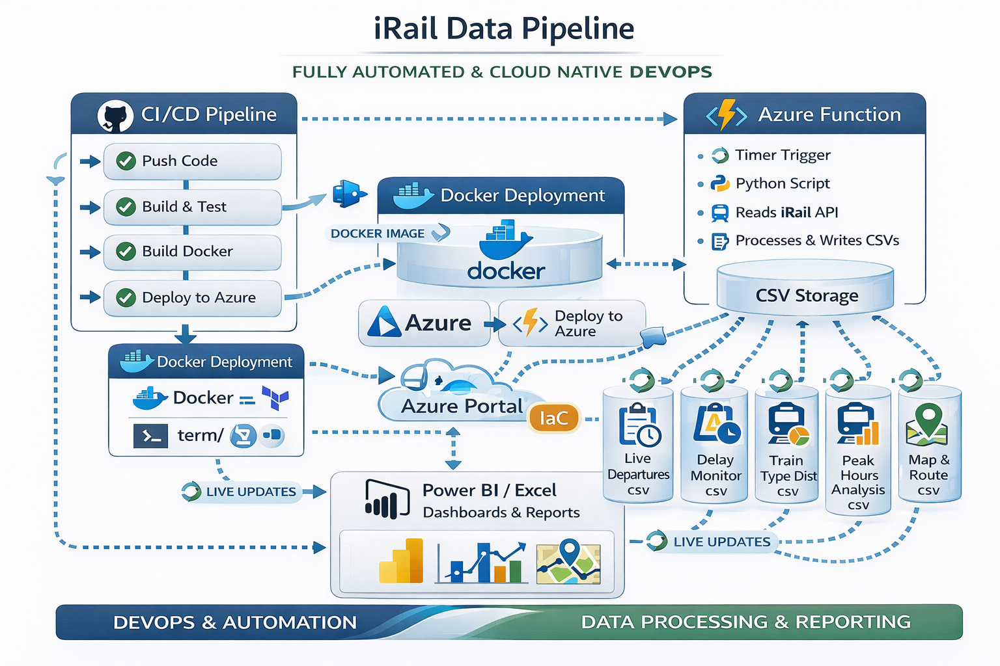

# Description 📊


This project creates a real-world data pipeline that fetches train departure data from the [iRail API](https://docs.irail.be/), normalizes it, and stores it in a SQL database — all deployed using Microsoft Azure.


---

# Table of Contents

- [Project Overview](#project-overview)  
- [Features](#features)  
- [Dataset](#dataset)  
- [Building the SQL pipeline](#building-the-sql-pipeline)   
- [Creating visuals in PowerBI](#creating-visuals-in-powerbi)
- [Deployment to Azure](#deployment-to-azure) 
- [Project Structure](#project-structure)   


---

# Project Overview

This project is structured in three progressive levels:

- 🟢 Setting up the core functionality — fetch and store data via Azure Portal using Azure Functions and Azure SQL Database.
- 🟡 Adding automation (scheduling), build a live dashboard (e.g., Power BI), and enable data refresh.
- 🔴 Exploring full DevOps integration — CI/CD pipelines, scripting with Azure CLI, Docker deployment, and cloud-native infrastructure as code.

Due to license restictions in Azure (multiple accounts which cannot be deleted), another approach was chosen based on CSV file creation 
using VSCode and Python. Uploading to GitHub allowed deployment to Azure. 





The dashboard contains:


- **Live Departure Board**: Show current or recent train departures for a selected station
- **Delay Monitor**: Track which stations or trains experience the most delays over time
- **Route Explorer**: Let users check travel time and transfer info between two cities
- **Train Type Distribution**: Visualize where and how different train types (IC, S, etc.) operate
- **Peak Hour Analysis**: Show how train traffic and delays vary by time of day or week
- **Real-Time Train Map** (advanced): Plot moving trains with geolocation


---

# Features

Taking the project to production-grade deployment using DevOps practices and cloud scripting.


---

# Dataset

The raw dataset is structured as CVS files stocked in a CVS storage.


  
  
---

# Building the SQL pipeline


## Key steps


1. **Create Azure SQL Database** via the portal:
   - Use the “Create a resource” wizard
   - Set up firewall to allow external IP
   - Note the connection string for later use

2. **Create an Azure Function App**:
   - Use “Python 3.10” as the runtime
   - Deploy an HTTP-triggered function using the web editor
   - Use environment variables for credentials (in App Settings)

3. **Implement the logic** to:
   - Call the iRail API (`/liveboard` or /`connections`)
   - Normalize the JSON using Python libraries (e.g., pandas)
   - Connect and write to Azure SQL

4. **Test the Function** directly from the portal and verify that the data appears in your SQL table.

  

  
### Advanced Features

1. **CI/CD Pipeline**  
   - Automate building, testing, and deploying of the Function App and infrastructure.  
   - Use GitHub Actions or Azure DevOps Pipelines for repeatable, reliable delivery.

2. **Containerization with Docker**  
   - Package your Azure Function or pipeline code in Docker containers.  
   - Deploy containers to Azure Container Registry and run via Azure Functions Premium Plan or Azure Container Apps.

---

# Creating visuals in PowerBI


- Maps, tables, bar charts are made accordingly to the desired question.
  


---

# Deployment to Azure


- 
  

---


# Project Structure

```bash

08-railway-scraper-cloud/
├── .venv/
├── .github/workflows/
├── irail_pipeline_csv/
├── functionapp/
├── host.json
├── local.settings.json
├── requirements.txt
├── Dockerfile
└── README.md

     

---


This project is part of AI & Data Science Bootcamp training at **`</becode>`** and it written by :

- Sandrine Herbelet  [LinkedIn](https://www.linkedin.com/in/) | [Github](https://github.com/Sandrine111222)

