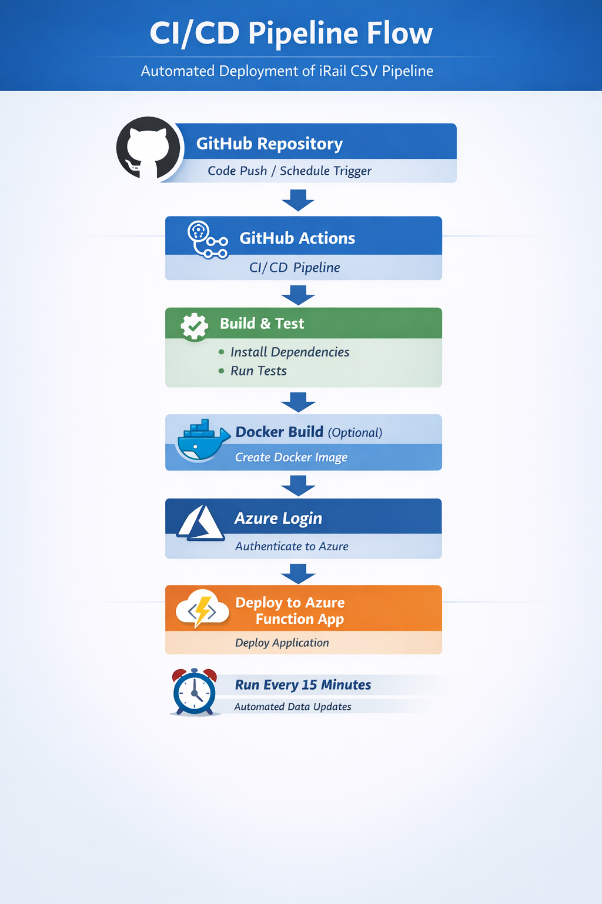
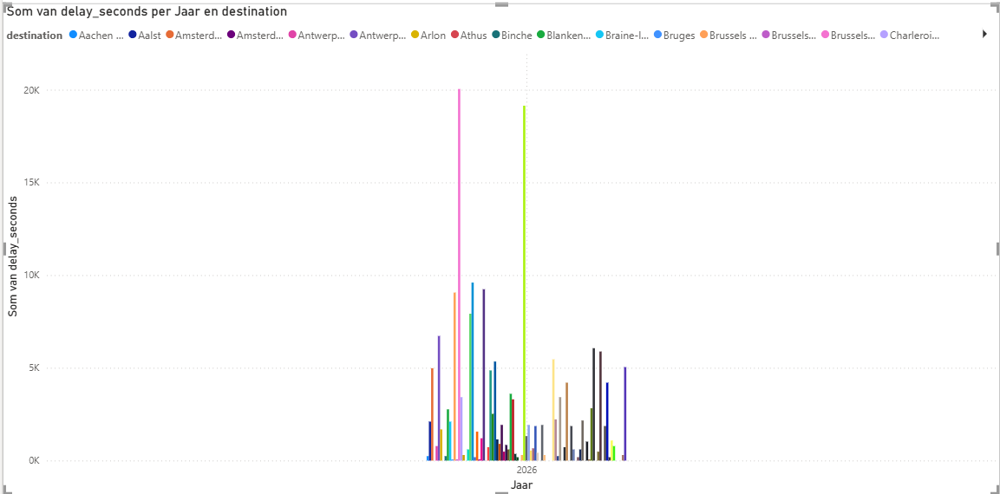

# Description 📊


This project creates a real-world data pipeline that fetches train departure data from the [iRail API](https://docs.irail.be/), normalizes it, and stores it in a CSV and SQLite database — ready for deployment in Microsoft Azure.


---

# Table of Contents

- [Project Overview](#project-overview)  
- [Features](#features)  
- [Dataset](#dataset)  
- [Building the Belgium-Wide iRail CSV and SQLite Pipeline](#building-the-belgium-wide-irail-csv-and-sqlite-pipeline)   
- [Creating visuals in PowerBI](#creating-visuals-in-powerbi)
- [Deployment to Azure](#deployment-to-azure) 
- [Project Structure](#project-structure)   


---

# Project Overview

This project is structured in three progressive levels:

- 🟢 Setting up the core functionality — fetch and store data via Azure Portal using Azure Functions and Azure SQL Database.
- 🟡 Adding automation (scheduling), build a live dashboard (e.g., Power BI), and enable data refresh.
- 🔴 Exploring full DevOps integration — CI/CD pipelines, scripting with Azure CLI, Docker deployment, and cloud-native infrastructure as code.

Due to license restictions in Azure (multiple accounts which cannot be deleted), another approach was chosen based on CSV file and SQLite Database creation 
using VSCode and Python. The code runs fully locally, simulating the Azure environment, while keeping it structured as if it were deployable. 


The dashboard contains:


- **Live Departure Board**: Shows current or recent train departures for a selected station.
- **Delay Monitor**: Tracks which stations or trains experience the most delays over time.
- **Route Explorer**: Lets users check travel time and transfer info between two cities.
- **Train Type Distribution**: Visualizes where and how different train types (IC, S, etc.) operate.
- **Peak Hour Analysis**: Shows how train traffic and delays vary by time of day or week.
- **Real-Time Train Map** (advanced): Plots moving trains with geolocation.

The pipeline uses timezone-aware UTC timestamps to ensure cloud compatibility and future-proof datetime handling.

This code is Azure-ready if the following adaptions would be made to the code:


| Component          | Status                |
| ------------------ | --------------------  |
| Azure Function     | ✅ (timer trigger)    |
| Azure Blob Storage | ✅ (replace CSV path) |
| Azure SQL          | 🔜 (same schema)      |
| Power BI           | ✅ (CSV / SQL source) |
| CI/CD              | ✅ (GitHub Actions)   |


---

# Features

- Taking the project to production-grade deployment using DevOps practices and cloud scripting.
- Fetch live departures from all major Belgian train stations.
- Track train routes and connections between selected stations.
- Log train positions with latitude and longitude.
- Store all data in CSV files and SQLite database, ready for analysis or cloud storage.
- Fully time-triggered via Azure Functions.
- Ready for CI/CD automation and containerized deployments.


---

# Dataset

The raw dataset is structured as CVS files stocked in a CVS storage and an SQLite database.
  
  
---

# Building the Belgium-Wide iRail CSV and SQLite Pipeline


## Key steps


1. **Create CSV and SQLite Database** (simulates Azure Blob Storage):
   - All station, train, and departure data will be stored in structured CSV files and SQLite database.
   - Store them locally or in a cloud storage location (e.g., Azure Blob Storage).
   - Ensure directories exist and proper permissions are set.

2. **Create an Azure Function App**:
   - Use Python 3.10 as the runtime.
   - Deploy a time-triggered function (e.g., every 15 minutes) to automate the pipeline.
   - Store sensitive information (if any) as environment variables in the Function App settings.

3. **Implement the logic** to:
   - Fetch real-time Belgian train data from the iRail API (/liveboard endpoint for live departures, /connections for routes).
   - Normalize JSON responses using Python standard libraries (csv, datetime, etc.).
   - Save structured data into CSV files:
              stations.csv – all Belgian stations
              trains.csv – all trains with types
              departures.csv – live departures including destination, platform, delays
              ...

4. **Test the Function**:
    - Trigger the Azure Function manually or via timer.
    - Verify that CSV files and SQLite database are populated correctly.
    - Ensure all stations and trains are included, and timestamps are in UTC.

  

  
### Advanced Features

1. **CI/CD Pipeline**  
   - Automate building, testing, and deployment of the Azure Function and pipeline code.
   - Use GitHub Actions or Azure DevOps Pipelines for repeatable, reliable delivery.
   - Include tests for the iRail API calls and CSV and SQLite database integrity.

2. **Containerization with Docker**  
   - Package the pipeline code or the Azure Function in a Docker container.
   - Deploy containers to Azure Container Registry.
   - Run using Azure Functions Premium Plan, Azure Container Apps, or other cloud-native services.





---

# Creating visuals in PowerBI


- Maps, tables, bar charts are made accordingly to the desired question.
  


Here, the delay monitor displays the sum of delay in seconds per station in Belgium per year.

---

# Deployment to Azure


- Create an **Azure Function App** in the portal using **Python 3.10** as the runtime.
- Deploy this pipeline code to the Function App.
- Configure a **time-triggered function** (e.g., every 15 minutes) to automate fetching and storing train data.
- Use **Application Settings** to securely store any sensitive information such as database credentials or API tokens.
- Once deployed, the function will automatically generate CSV files and update the database with real-time Belgian train data.

  

---


# Project Structure

```bash

08-railway-scraper-cloud/
├── .venv/
├── .github/workflows/
├── irail_pipeline_csv/
├── functionapp/
├── host.json
├── local.settings.json
├── requirements.txt
├── Dockerfile
└── README.md

     

---


This project is part of AI & Data Science Bootcamp training at **`</becode>`** and it written by :

- Sandrine Herbelet  [LinkedIn](https://www.linkedin.com/in/) | [Github](https://github.com/Sandrine111222)

